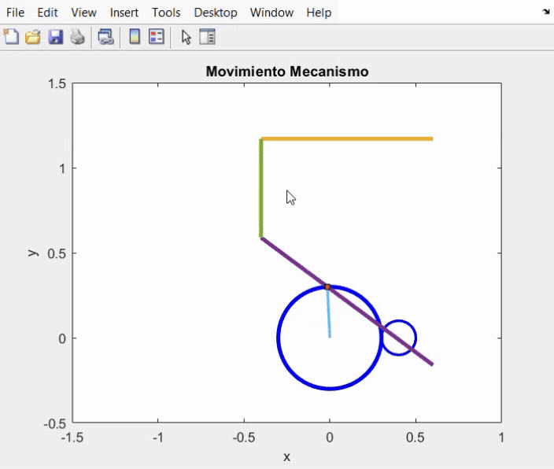

# Kinematic-and-kinetic-analisys-of-four-bars-mechanism
This project provides an analisys and MATLAB development of simulation and ecuation system of a mechanism composed by 4 bars and a transmission made by 2 gears.

The behavior of the system is governed by a set of arbitrarily defined initial parameters , as well as by the equations that describe its evolution over time. In this context, the system is considered to be fully controlled, with both the configuration and the driving input (startup motor) explicitly defined.

## Ecuation system

The analysis begins with a kinematic study, which leads to the formulation of a system of nonlinear equations. Due to the complexity of this system, the Newton–Raphson method is employed to iteratively solve for the unknown variables. These include angular positions (θ), angular velocities (ω), and angular accelerations (α).

[Show kinematic analysis](media/Analisis_cinematico.pdf)

Subsequently, a kinetic analysis is performed using the previously obtained kinematic variables. This results in a system of linear equations that allows the determination of forces and torques acting on each component of the mechanism. Through this analysis, the expected dynamic behavior of the end effector is fully characterized.

[Show kinetic analysis](media/Analisis_cinetico.pdf)

## Simulation

[Show simulation file](media/matlab_simulation.mp4)

